# West Ham United Team App

Please follow the link below to see the app live:
https://westhamapp.herokuapp.com/

This is a firebase app with both public and private routes. The player and match data was uploaded to firebase via a JSON file that I had created.

home page, with main, matches, team, and promotion sections. All links are working and live. The promotions input is linked with a firebase database to store contestants emails. This is a public page/route
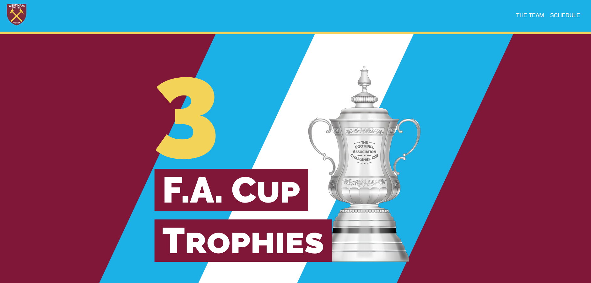
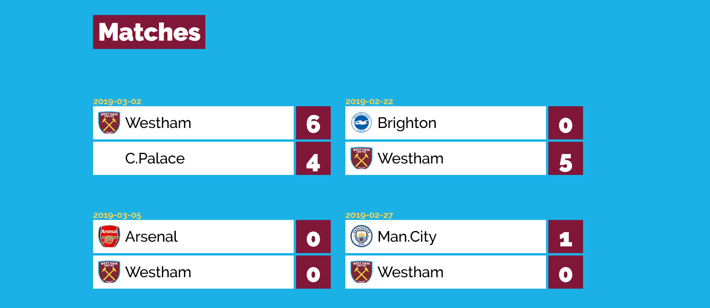
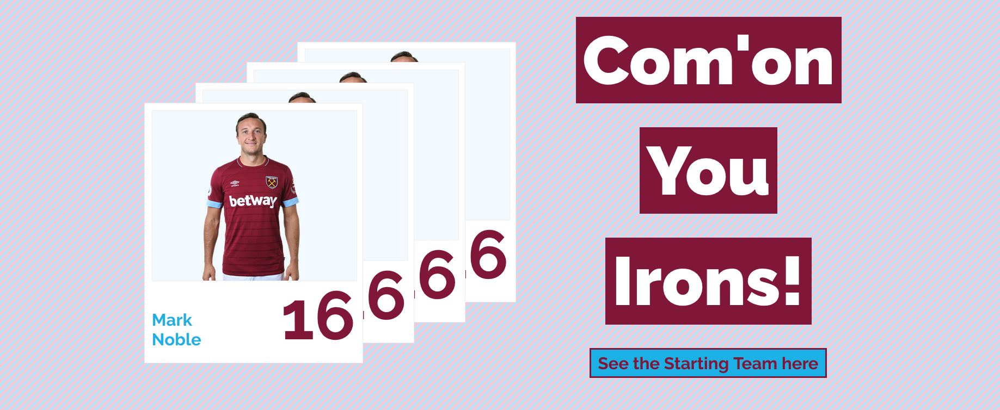
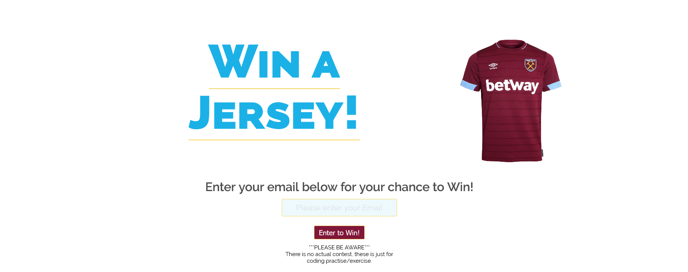

The team link in the nav bar leads the user to a page listing all the West Ham Senior players in a card format. This is a public page/route (/the_team)
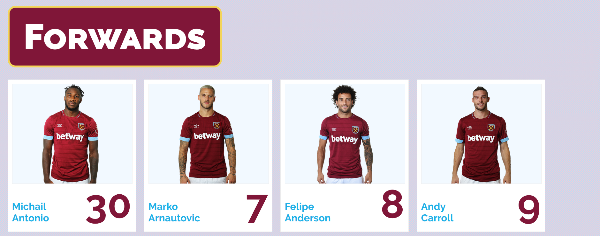

The schedule link in the nav bar also leads the user to another page. this time is page listing all west ham games. It allows the user to filter the games by result and by if the games have been played or not. It also shows the league table to the right. This is a public page/route (/schedule)
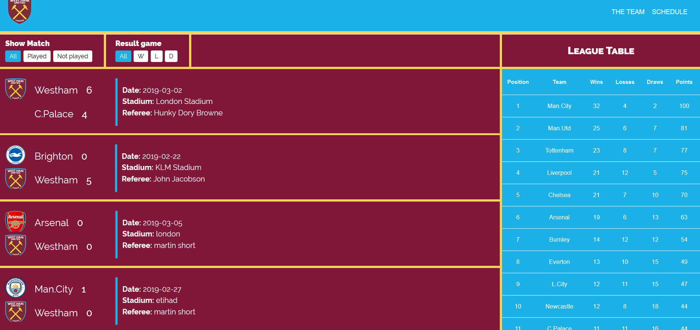

The private routes allow the owner of the page to change and maniuplate the team and schedules, allowing the owner of the page to keep up to date with the team and update this matches and players if needd (/sign_in)
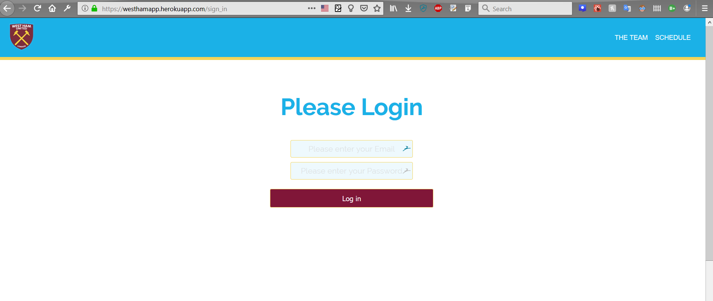

The dashboards below allow the owner of the page to access the necessary pages needed to maniuplate their teams rosters and schedules so taht they can udate scores etc.
(/dashboard)
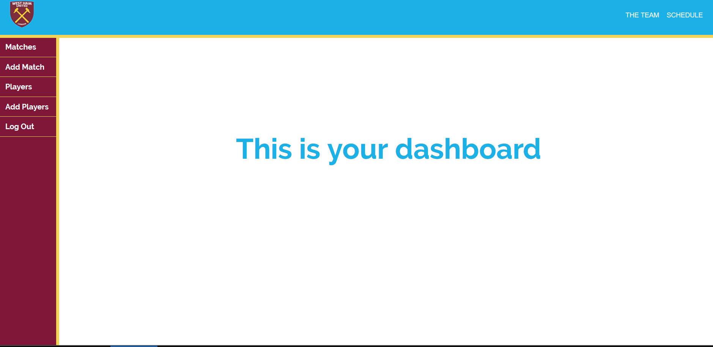
(/admin_matches)
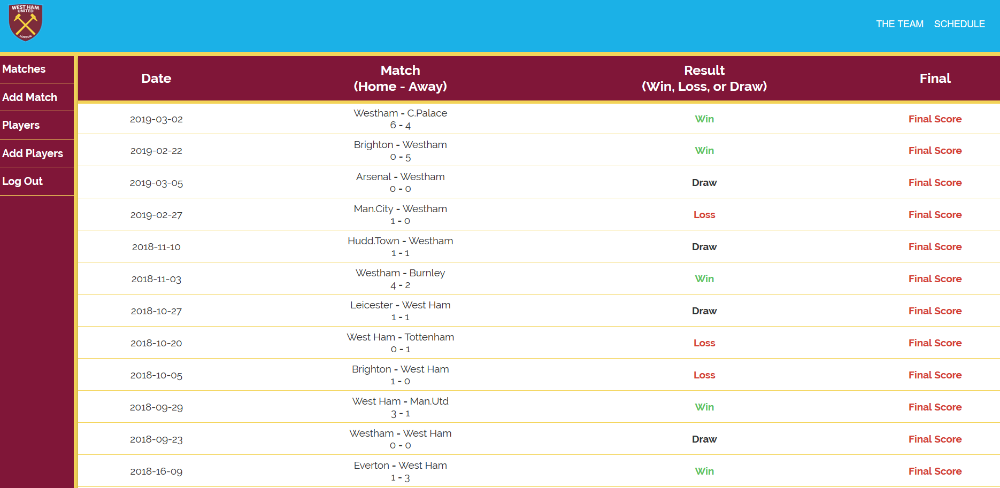
(/admin_players)
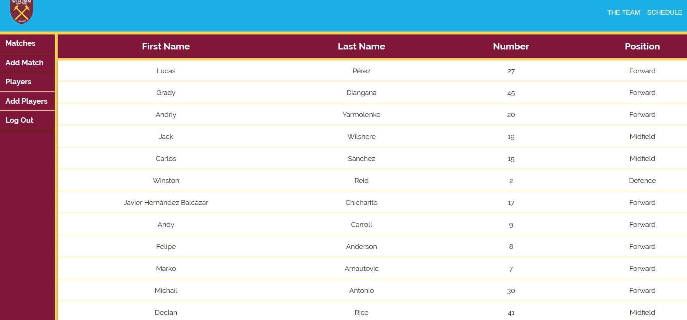

The section below shows where the page owner can maniplyuate the teams and players, either creating new players/matches or edititng them.
(/admin_matches/edit_match)
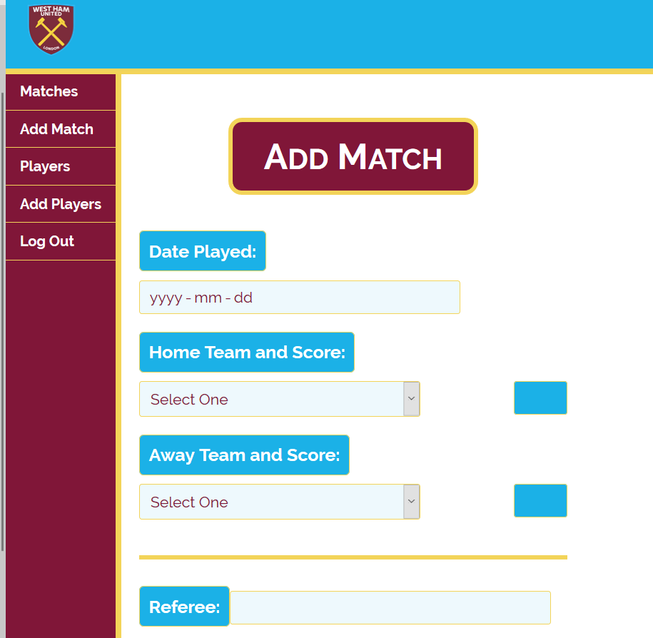
(/admin_players/add_players)
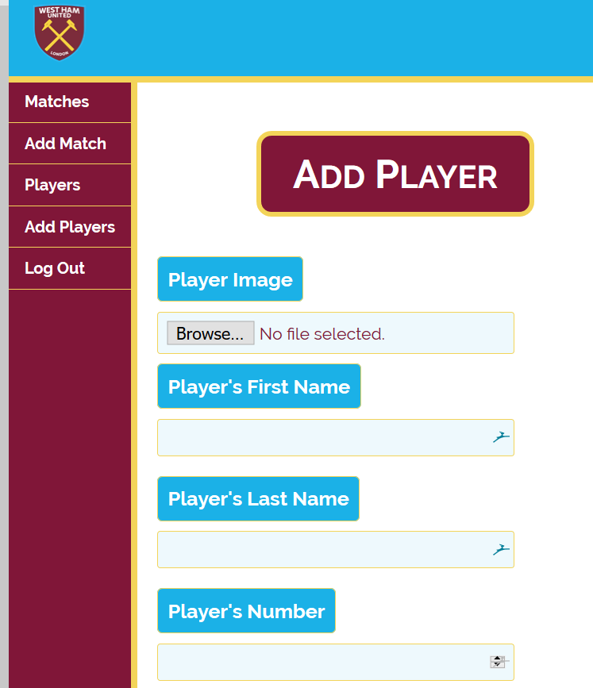

